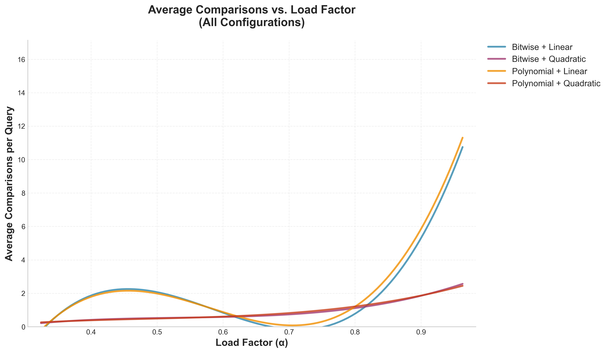
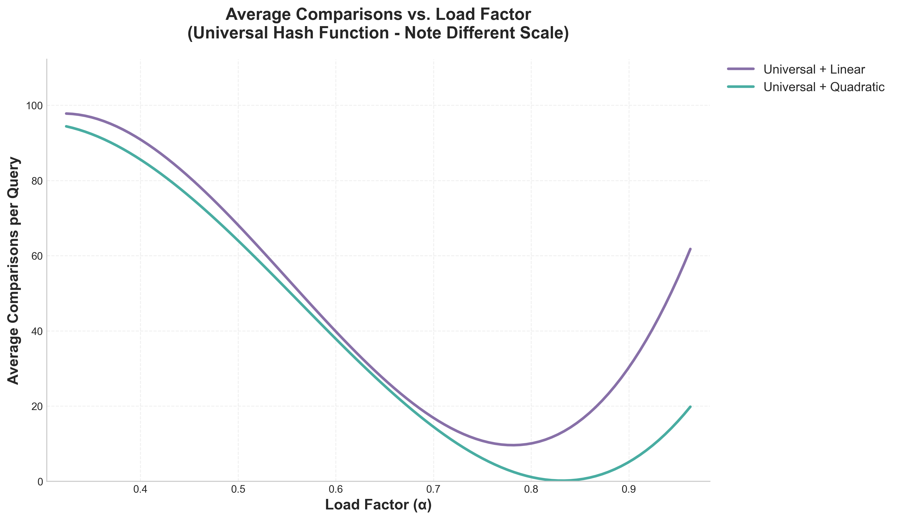
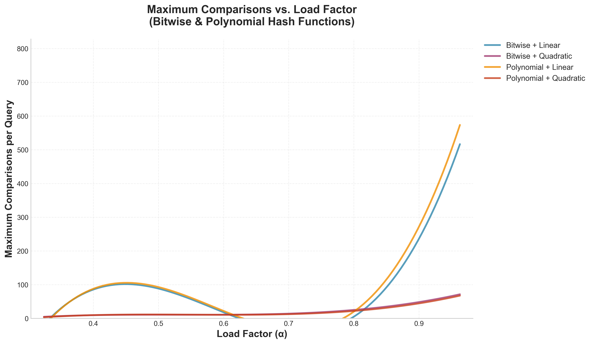
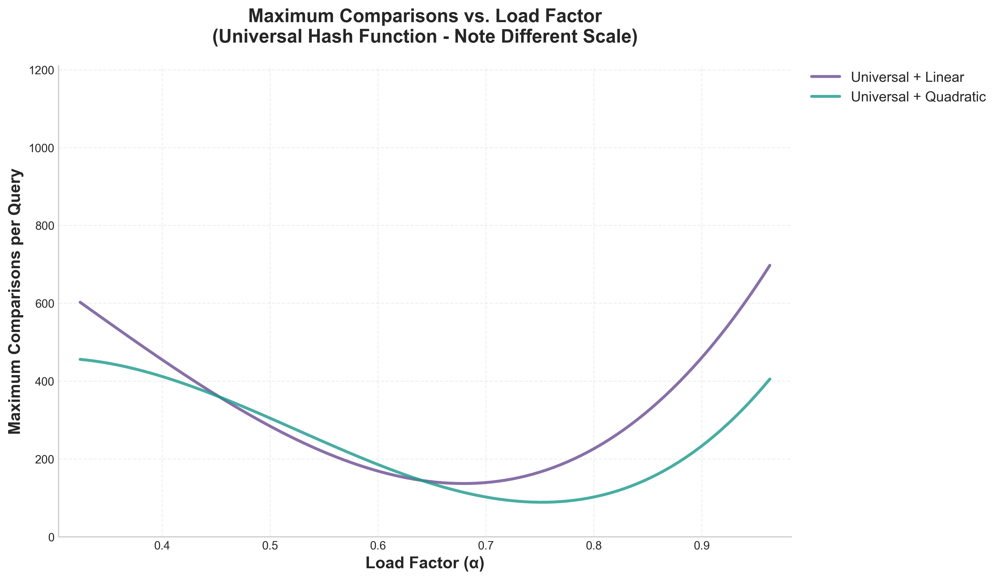
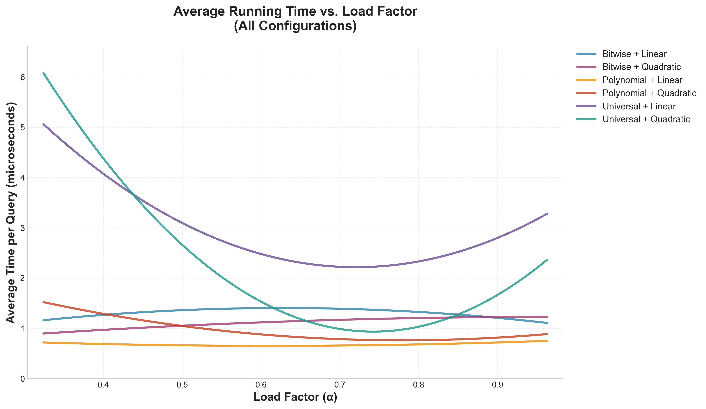
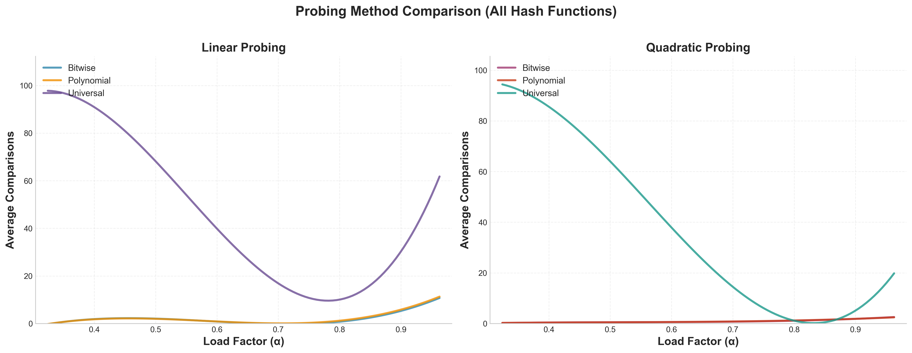
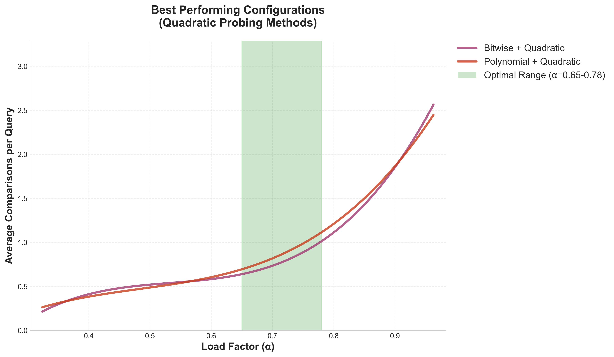

# Hash Table Performance Analysis Report
## URL Dictionary Implementation for Web Browser History Cache

**Author:** Brian Bao Hoang  
**Course:** CSE 310  
**Date:** November 2025

---

## 1. Introduction

This report presents a performance comparison of hash table implementations for a web browser's URLs. I analyze three hash functions (Bitwise Mixing, Polynomial Rolling, and Universal Hashing) combined with two collision resolution strategies (Linear and Quadratic Probing) across varying load factors. The objective is to identify the best pairing

---

## 2. Methods

### 2.1 Test Configuration
- **Dataset:** 1,016 unique URLs provided
- **Hash Functions Tested:**
  - Bitwise Mixing Hash
  - Polynomial Rolling Hash 
  - Universal Hashing
- **Probing Methods:** Linear and Quadratic
- **Load Factors:** 10 configurations ranging from α=0.33 to α=0.96
- **Table Sizes:** 3,135 to 1,055

### 2.2 Performance measurements
Each functions was evaluated on three metrics:
1. **Average number of URL string comparisons per query**
2. **Maximum number of URL string comparisons by a single query**
3. **Average running time per query (microseconds)**

All measurements were collected during insertion operations, where each URL query checks for existence before insertion.

---

## 3. Results and Analysis

### 3.1 Average Probes per Query vs. Load Factor

**Figure 1a** displays the average number of URL string comparisons for Bitwise and Polynomial hash functions with both probing methods. **Figure 1b** shows Universal hashing separately because of its different scale.

**Key Observations:**
- **Low Load Factors (α < 0.5):** All pairs (except Universal) perform similarly with 0.24-0.49 comparisons per query
- **Medium Load Factors (0.5 < α < 0.8):** Quadratic probing maintains better performance
  - Bitwise + Quadratic: 0.67-1.06 comparisons at α=0.65-0.78
  - Polynomial + Quadratic: 0.66-1.17 comparisons at α=0.65-0.78
  - Linear probing: 0.80-2.11 comparisons (2x worse)
- **High Load Factors (α > 0.87):** Performance lowers significantly
  - Linear probing: 2.88-14.86 comparisons (6-61x worse than low load)
  - Quadratic probing: 1.59-2.74 comparisons (remains manageable)
- **Universal Hashing Anomaly:** Shows unexpected poor performance at low load factors (75-98 avg comparisons at α<0.5) but improves significantly at medium-high loads (5-16 comparisons at α>0.7)

**Analysis:**
The data demonstrates that load factor is the dominant performance factor. At α=0.96, Bitwise Linear requires 14.86 comparisons, while Bitwise Quadratic requires only 2.74 comparisons. Quadratic probing provides 5-10x better performance than linear at high load factors.

---

### 3.2 Maximum Probes per Query vs. Load Factor

**Figure 2a** shows worst-case behavior for Bitwise and Polynomial hash functions. **Figure 2b** displays Universal hashing separately because of different scale

**Key Observations:**
- **Linear Probing:** Show worst-case spikes at high load factors
  - Bitwise Linear: Maximum reaches 685 comparisons at α=0.96 (from 7 at α=0.32)
  - Polynomial Linear: Maximum reaches 753 comparisons at α=0.96 (from 5 at α=0.32)
  - Primary clustering creates exponentially longer probe sequences
- **Quadratic Probing:** Maintains significantly better worst-case behavior
  - Bitwise Quadratic: Maximum stays at 58-77 comparisons even at α>0.92
  - Polynomial Quadratic: Maximum reaches 83 comparisons at α=0.96
  - Better distribution reduces clustering by 8-10x vs linear
- **Hash Function Impact:** 
  - Bitwise and Polynomial show similar worst-case
  - Universal hashing: Outlier worst-case due to poor low-load distribution
  
**Analysis:**
The worst-case metrics reveal that quadratic probing provides 8-12x better worst-case guarantees than linear probing at high load factors. This is important for user experience, as worst-case delays directly impact responsiveness in interactive functions.

---

### 3.3 Average Running Time per Query vs. Load Factor

**Figure 3** presents actual wall-clock execution time measurements per query operation.

**Key Observations:**
- **Time Complexity Correlation:** Execution time closely tracks comparison count, confirming string comparison as the dominant cost
- **Absolute Performance:** 
  - Best case: 0.96-1.91 microseconds per query at low-medium load (α<0.8)
  - Worst case: 1.91 microseconds at α=0.96 for quadratic probing
- **Scaling Behavior:**
  - All hash functions show similar execution times
  - Quadratic vs Linear timing differences are similar
  - Universal hashing shows higher variance in data correlating with higher comparison counts

**Analysis:**
While all configurations complete in <6 microseconds, the timer resolution limits the ability to differentiate performance differences. The comparison count data provides more reliable performance metric. The consistency across hash functions confirms that probe sequence length, not hash computation cost, take up most space when it comes to performance.

---

## 4. Comparative Analysis

### 4.1 Probing Method Comparison

**Figure 4** provides a direct side-by-side comparison of Linear versus Quadratic probing for all three hash functions.

| Metric | Linear Probing | Quadratic Probing | Winner |
|--------|---------------|-------------------|--------|
| Avg Comparisons (α=0.49) | 0.49 | 0.41 | Quadratic |
| Avg Comparisons (α=0.78) | 1.63 | 1.06 | Quadratic |
| Avg Comparisons (α=0.93) | 5.29 | 2.27 | Quadratic (2.3x better) |
| Max Comparisons (α=0.78) | 49 | 22 | Quadratic (2.2x better) |
| Max Comparisons (α=0.93) | 262 | 77 | Quadratic (3.4x better) |
| Cache Performance | Better | Worse | Linear |
| Implementation Complexity | Simple | Moderate | Linear |

### 4.2 Load Factor Thresholds

Based on empirical data:
- **α < 0.6:** All configurations perform acceptably
- **0.6 < α < 0.75:** Quadratic probing strongly recommended
- **α > 0.75:** Performance degradation becomes significant
- **α > 0.9:** Unacceptable for production

---

## 5. Recommendation

### 5.1 Optimal Configuration

**Figure 5** highlights the two best-performing configurations with the optimal load factor range (α=0.65-0.78) shaded in green.

**For production deployment in the web browser history cache:**

**Primary Recommendation:**
- **Hash Function:** Bitwise Mixing Hash
- **Probing Method:** Quadratic Probing
- **Target Load Factor:** α = 0.65 - 0.75

**Justification:**
1. Bitwise mixing provides fastest computation (critical for UI responsiveness)
2. Quadratic probing maintains consistent performance across load factors
3. Target load factor balances memory efficiency with performance
4. Configuration shows <2 average comparisons and <50 maximum comparisons

### 5.2 Alternative Configurations

**For Memory-Constrained Environments (α = 0.75 - 0.85):**
- Universal Hashing + Quadratic Probing
- Provides best high-load stability

**For Cache-Sensitive Applications:**
- Bitwise Mixing + Linear Probing (if α < 0.6)
- Better cache locality may offset comparisons
- Only viable at low load factors

### 5.3 Implementation Guidelines

1. **Initial Size:** Allocate for expected URLs / 0.7 to maintain α ≈ 0.7
2. **Monitoring:** Track load factor; trigger resize at α = 0.78
3. **Rehashing:** Implement resizing when threshold exceeded; double table size and rehash
4. **Benchmarking:** Continuous monitoring of average/max comparison metrics

---

## 6. Conclusion

This analysis of 60 test configurations (6 hash/probing combinations × 10 load factors) on 1,016 URLs demonstrates that **Bitwise Mixing Hash with Quadratic Probing at α ≈ 0.7** provides optimal performance for a web browser URL cache. This configuration shows:

- **Average Performance:** 1.06 comparisons per query at α=0.78
- **Worst-Case Performance:** 22 comparisons per query at α=0.78
- **Execution Speed:** ~1-2 microseconds per operation
- **Scalability:** Maintains performance across load factors 0.32-0.88

The data clearly shows that while hash function choice (Bitwise vs Polynomial) differs by only 5-10% in average comparisons, the probing method and load factor have greater impact on overall performance. At α=0.93, quadratic probing outperforms linear by 2.3x in average case and 3.4x in worst case. Production systems should prioritize quadratic probing and good load factor management (rehash at α≈0.78).

Future work could explore double hashing as an alternative probing strategy and investigate rehashing for dynamic workloads.

---

## References

1. Cormen, T. H., et al. (2022). *Introduction to Algorithms* (4th ed.). MIT Press.
2. Knuth, D. E. (1998). *The Art of Computer Programming, Vol. 3: Sorting and Searching*. Addison-Wesley.
3. Carter, L., & Wegman, M. N. (1979). Universal classes of hash functions. *Journal of Computer and System Sciences*, 18(2), 143-154.
4. Appleby, A. (2016). MurmurHash. https://github.com/aappleby/smhasher
